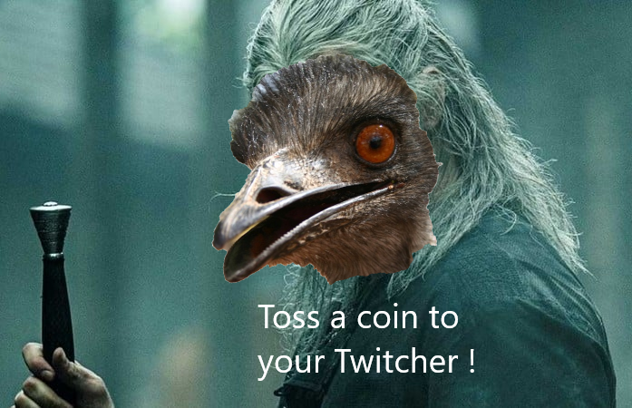
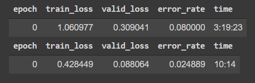

# The Twitcher

The objective of this project was to create a AI that predict a bird's species from an image, this project is actually online at the following link : 

## The database

We found a database of 225 species of birds on Kaggle : https://www.kaggle.com/gpiosenka/100-bird-species .
  The data is sorted by species.

## How we did it

To realised this AI we used fastai (https://www.fast.ai/), it's a deep learning library which provides practitioners with high-level components that can quickly and easily provide state-of-the-art results in standard deep learning domains.

To train our model we loaded the pre-trained model resnet34 (https://www.kaggle.com/pytorch/resnet34) and have fine tuned it with our database.
For us only one epoch was enough to get good results.

The weights are saved in the *birds_model.pkl* file.

Then we used Flask (https://palletsprojects.com/p/flask/) and Heroku (https://www.heroku.com/) to put the AI online.

## Requirements

If you want to use this project on your own computer, here are the requirements you will need : 

**For** ***The_Twitcher.ipynb***
* fastbook
* fastai

**For** ***api.py***
* flask
* fastai

## Authors
* **Cresson François**
* **Croquet Max**
* **Heras Matthieu**